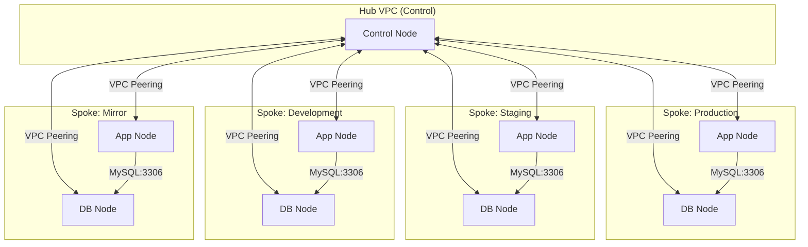

# Project Infrastructure Overview

This document provides a detailed map of the AWS infrastructure managed by this Terraform project.

## 🗺 Network Architecture: Hub & Spoke

The project follows a **Hub & Spoke** model where a central **Control VPC** (Hub) acts as the management point for all other environment VPCs (Spokes).

## 📋 Environment Mapping

| Environment | Component | VPC CIDR | Region | Allowed Admin Access |
|-------------|-----------|----------|--------|----------------------|
| **Production** | Control (Hub) | `10.11.0.0/16` | us-west-2 | SSH (22), Ping (ICMP) |
| **Production** | Application | `10.21.0.0/16` | us-west-2 | None (via Hub) |
| **Production** | Database | `10.31.0.0/16` | us-west-2 | None (via Hub) |
| **Staging** | Application | `10.21.0.0/16`* | us-west-2 | None (via Hub) |
| **Staging** | Database | `10.31.0.0/16`* | us-west-2 | None (via Hub) |
| **Development** | Application | `10.21.0.0/16`* | us-west-2 | None (via Hub) |
| **Development** | Database | `10.31.0.0/16`* | us-west-2 | None (via Hub) |
| **Mirror** | Application | `10.21.0.0/16`* | us-west-2 | None (via Hub) |
| **Mirror** | Database | `10.31.0.0/16`* | us-west-2 | None (via Hub) |

> [!WARNING]
> **CIDR Overlap**: Multiple spoke environments share the same CIDR blocks (`10.21.0.0/16` and `10.31.0.0/16`). While they are separate VPCs, this will prevent concurrent peering to the Hub VPC without conflict. It is recommended to use unique CIDRs per VPC in a real multi-environment production setup.

## 🔐 Connectivity & Security Rules

### 1. External Access (Admin)
- **Target**: Control Node (Control VPC).
- **Source**: Your specific Admin IP (`206.189.42.196/32`).
- **Ports**: 22 (SSH), ICMP (Ping).

### 2. Internal Management (Hub-to-Spoke)
- **Source**: Control VPC CIDR (`10.11.0.0/16`).
- **Target**: All Spokes (App & DB).
- **Ports**: 22 (SSH), ICMP (Ping), 3306 (MySQL - to DB nodes only).

### 3. Service Connectivity (App-to-DB)
- **Source**: App VPC CIDR (e.g., `10.21.0.0/16`).
- **Target**: Database VPC Node (within same environment).
- **Port**: 3306 (MySQL).

## 🔑 SSH Key Mapping
Each component has its own dedicated SSH key for improved security.

| Environment | Component | Key Filename (in `~/.ssh/`) |
|-------------|-----------|-----------------------------|
| **Production** | Control (Hub) | `secret-key-prod-control-us-west-2.pem` |
| **Production** | Application | `secret-key-prod-app-us-west-2.pem` |
| **Production** | Database | `secret-key-prod-db-us-west-2.pem` |
| **Staging** | Application | `secret-key-staging-app-us-west-2.pem` |
| **Staging** | Database | `secret-key-staging-db-us-west-2.pem` |
| **Development** | Application | `secret-key-dev-app-us-west-2.pem` |
| **Development** | Database | `secret-key-dev-db-us-west-2.pem` |
| **Mirror** | Application | `secret-key-mirror-app-us-west-2.pem` |
| **Mirror** | Database | `secret-key-mirror-db-us-west-2.pem` |

## 🚀 Deployment Hierarchy
1. **Global Backend**: S3 Bucket & DynamoDB (for State).
2. **Control VPC**: The Hub for all connections.
3. **Environment VPCs**: Application and Database spokes.
4. **Peering**: Establishing routes between Hub and Spokes.

## 🗑 Cleanup Procedure
To gracefully tear down the infrastructure, follow this reverse order:
1. **Peering Connections**: Remove all peering modules first (`peering` folders).
2. **Spoke Resources**: Destroy `application` and `database` components.
3. **Hub Resource**: Destroy the `control` component.
4. **Global Resources**: Destroy `global/backend` and `global/iam` (last).

> [!CAUTION]
> Destroying the `global/backend` will remove the S3 bucket containing your state files. Ensure all environments are destroyed before running this!
