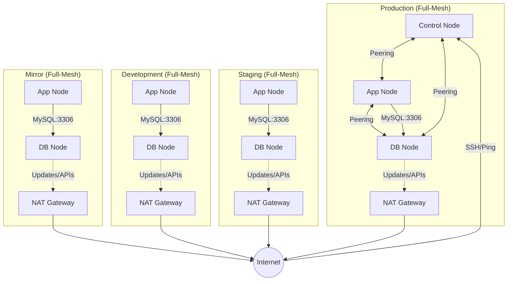

# Project Infrastructure Overview

This document provides a detailed map of the AWS infrastructure managed by this Terraform project.

## 🗺 Network Architecture: Full-Mesh Peering

The project has evolved from a Hub & Spoke model to a **Full-Mesh Architecture** within each environment. Every VPC (`Control`, `Application`, `Database`) is directly peered with every other VPC to ensure seamless, non-transitive connectivity.

## 📋 Environment Mapping

All components use environment-specific prefixes (e.g., `production-application-node`) for easy identification.

| Environment | Component | VPC CIDR | Region | Internet Access |
|-------------|-----------|----------|--------|-----------------|
| **Production** | Control | `10.11.0.0/16` | us-west-2 | Public IP |
| **Production** | Application | `10.21.0.0/16` | us-west-2 | Public IP |
| **Production** | Database | `10.31.0.0/16` | us-west-2 | **NAT Gateway** |
| **Development** | Application | `10.22.0.0/16` | us-west-2 | Public IP |
| **Development** | Database | `10.32.0.0/16` | us-west-2 | **NAT Gateway** |
| **Staging** | Application | `10.23.0.0/16` | us-west-2 | Public IP |
| **Staging** | Database | `10.33.0.0/16` | us-west-2 | **NAT Gateway** |
| **Mirror** | Application | `10.24.0.0/16` | us-west-2 | Public IP |
| **Mirror** | Database | `10.34.0.0/16` | us-west-2 | **NAT Gateway** |

> [!NOTE]
> **Automated CIDR Management**: ALL network CIDR references are dynamically retrieved from `terraform_remote_state` to ensure 100% consistency throughout the infrastructure.

> [!TIP]
> **Unique CIDR Scheme**: Each environment tier uses a unique IP space (`10.22`, `10.23`, `10.24` etc.) to enable seamless cross-VPC routing from the Hub without IP conflicts.

## 🔐 Connectivity & Security Rules

### 1. External Access (Admin)
- **Target**: Control Nodes.
- **Source**: Authorized Admin CIDRs.
- **Access**: SSH (22), Ping (ICMP), and **Serial Console** (via IAM).

### 2. Internal Management (Peered Connectivity)
- **Architecture**: Full-Mesh within each environment tier.
- **Centralized Security**: Inter-VPC ICMP (ping) and MySQL rules are managed exclusively by the `peering` module to avoid dependency cycles.
- **Base Access**: SSH (22) and local rules are managed by the `ec2` module.
- **Dynamic Rules**: Security groups use `for_each` and remote state lookups to automatically configure routing across all peered VPCs.

### 3. Outbound Internet (Private Nodes)
- **Solution**: AWS NAT Gateway.
- **Target**: Private subnets in Database VPCs.
- **Benefit**: Secure internet access for OS updates and API calls without a public IP address.

### 4. Private Subnet Routing (Return Paths)
- **Requirement**: All component modules (`application`, `database`) must export `private_route_table_ids` via remote state.
- **Logic**: The `peering` module uses these IDs to inject return routes for peered VPCs. Without these, nodes in private subnets can receive traffic but cannot respond (unidirectional connectivity).

## 🔑 SSH Key Mapping
Each component has its own dedicated SSH key for improved security.

| Environment | Component | Key Filename (in `~/.ssh/`) |
|-------------|-----------|-----------------------------|
| **Production** | Control (Hub) | `secret-key-prod-control-us-west-2.pem` |
| **Production** | Application | `secret-key-prod-app-us-west-2.pem` |
| **Production** | Database | `secret-key-prod-db-us-west-2.pem` |
| **Staging** | Application | `secret-key-staging-app-us-west-2.pem` |
| **Staging** | Database | `secret-key-staging-db-us-west-2.pem` |
| **Development** | Application | `secret-key-dev-app-us-west-2.pem` |
| **Development** | Database | `secret-key-dev-db-us-west-2.pem` |
| **Mirror** | Application | `secret-key-mirror-app-us-west-2.pem` |
| **Mirror** | Database | `secret-key-mirror-db-us-west-2.pem` |

## 🚀 Deployment Hierarchy
1. **Global Backend**: S3 Bucket & DynamoDB (for State).
2. **Control VPC**: The Hub for all connections.
3. **Environment VPCs**: Application and Database spokes.
4. **Peering**: Establishing routes between Hub and Spokes.

## 🗑 Cleanup Procedure
To gracefully tear down the infrastructure, follow this reverse order:
1. **Peering Connections**: Remove all peering modules first (`peering` folders).
2. **Spoke Resources**: Destroy `application` and `database` components.
3. **Hub Resource**: Destroy the `control` component.
4. **Global Resources**: Destroy `global/backend` and `global/iam` (last).

> [!CAUTION]
> Destroying the `global/backend` will remove the S3 bucket containing your state files. Ensure all environments are destroyed before running this!
